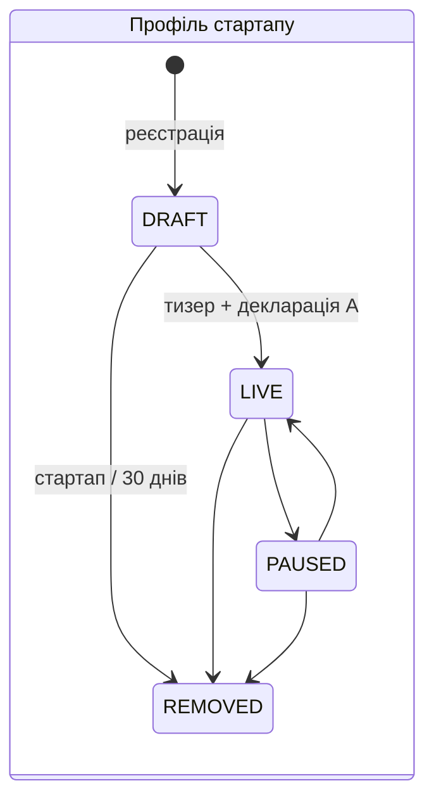
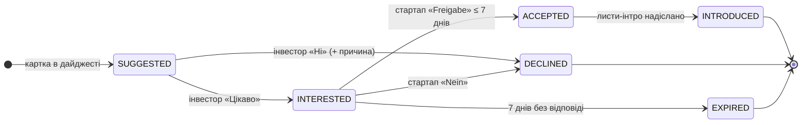

# Start Share — база даних (MVP)

Реляційна схема даних B2B-платформи **Start Share**, що знайомить стартапи та професійних інвесторів
(Німеччина, ЄС). Платформа **лише знайомить**: не дає інвестиційних порад, не бере участі в переговорах
і не проводить гроші. Тому в БД немає угод, платежів, data room чи чату — лише те, що потрібно до моменту
знайомства і для аналітики.

| | |
|---|---|
| Версія схеми | 2026-10-05 (після скорочення таблиць і додавання підписок) |
| СУБД | PostgreSQL 16+ |
| Backend | Django 5.2+ (Django ORM, `django.contrib.postgres`) |
| Обсяг | таблиць — 32, колонок — 341, CHECK-обмежень — 106, зовнішніх ключів — 49; аналітичний шар — 18 матеріалізованих view і таблиця щоденних знімків |
| Головне джерело вимог | `Логіка_Start_Share.docx` + BA-02, BA-04, BA-TP, BA-AI-01, BA-AI-02, рішення від 05.10.2026 |

## Зміст

1. [Принципи проєктування](#1-принципи-проєктування)
2. [Файли](#2-файли)
3. [ER-діаграма](#3-er-діаграма)
4. [Каталог таблиць](#4-каталог-таблиць)
5. [Конвенції](#5-конвенції)
6. [Машини станів](#6-машини-станів)
7. [Матчинг](#7-матчинг)
8. [Аналітика і Data Science](#8-аналітика-і-data-science)
9. [Продуктивність і масштабування](#9-продуктивність-і-масштабування)
10. [Аналітичний шар (схема analytics)](#10-аналітичний-шар-схема-analytics)
11. [Підписки та монетизація](#11-підписки-та-монетизація)
12. [Приватність і GDPR](#12-приватність-і-gdpr)
13. [Розгортання з Django та нічне обслуговування](#13-розгортання-з-django-та-нічне-обслуговування)
14. [Рішення від 05.10.2026](#14-рішення-від-05102026)
15. [Відкриті питання](#15-відкриті-питання)

## 1. Принципи проєктування

- **Анонімність до «Freigabe».** Назва компанії та контакти стартапу лежать в окремій таблиці
  `startup_private_details` (1:1 з профілем). API сліпої картки її не читає; інвестор отримує ці дані лише
  в листі-інтро після згоди стартапу (REQ-02, REQ-05).
- **Цілісність у самій БД.** Статуси, обов'язкові поля для кожного статусу, діапазони, «одна чинна версія»
  та заборонені переходи статусів перевіряє PostgreSQL (CHECK, часткові UNIQUE, тригери), а не лише код.
- **Версії замість перезапису.** Мандат інвестора (REQ-19), тизер (затвердження + декларація A) і юридичні
  тексти мають версії. Знайомство пам'ятає, за якою версією мандату і тизера показано картку.
- **Коди замість тексту.** Сектори, стадії, країни, землі, причини відмов — довідники зі стабільними кодами.
  Матчинг і аналітика працюють за кодами; назви DE/EN можна змінювати.
- **Аналітика з першого дня.** Кожен крок воронки має часову мітку в бізнес-таблиці, а журнал `events`
  відтворює Tracking Plan (BA-TP) без персональних даних.
- **Нічого «про всяк випадок».** Кожна таблиця і поле мають джерело у вимогах; пропозиції позначені як
  пропозиції, а невизначене винесено у відкриті питання.

## 2. Файли

| Файл | Що це |
|---|---|
| `db/startshare_schema_postgres.sql` | **Уся база одним файлом**: таблиці, обмеження, індекси, секціонування `events`, тригери, функції обслуговування, коментарі, початкові дані довідників, способів оплати, безкоштовних тарифів і параметрів, а в кінці — аналітичний шар (схема `analytics`: матеріалізовані view KPI, щоденний знімок, функції оновлення). Виконується в одній транзакції |
| `backend/<app>/models.py` | Django-моделі; міграції Django + RunSQL створюють ту саму структуру, що й `startshare_schema_postgres.sql` |
| `docs/database/NN_Database_<таблиця>_StartShare.docx` | Технічний опис кожної таблиці: контекст, бізнес-питання, поля, обмеження, аналітика, тестові дані, відкриті питання |
| `docs/database/33_Database_analytics_StartShare.docx` | Опис аналітичного шару: view, колонки, розклад, виміри продуктивності |
| `db/tests/*.sql` | Перевірки: `behaviour.sql` (72 сценарії бізнес-правил, включно з рахунками й ПДВ), `partitions.sql` (секції й очищення), `analytics.sql` (49 показників, включно з MRR, відтоком, переходом з безкоштовної фази, способами оплати), `load_data.sql` + `perf.sql` (синтетичний обсяг і виміри) |
| `README.md` | Цей огляд |

Перевірено на PostgreSQL 16: бази, створені зі `startshare_schema_postgres.sql` і з міграцій Django
(+ RunSQL), збігаються за таблицями, колонками, типами, NULL, DEFAULT, CHECK, UNIQUE, FK, `ON DELETE`
та індексами; на обох проходять поведінкові тести (62 сценарії), тести секціонування й очищення та
перевірка правильності аналітики (35 показників).

## 3. ER-діаграма

Зв'язки між таблицями (`||--o{` — один до багатьох, `||--o|` — один до одного). Довідники мають
багато зв'язків, тому діаграма велика; детальні зв'язки — у документі кожної таблиці.

```mermaid
erDiagram
    users ||--o{ user_consents : "user_id"
    legal_documents ||--o{ user_consents : "legal_document_id"
    countries ||--o{ regions : "country_code"
    users ||--o| startup_profiles : "user_id"
    sectors ||--o{ startup_profiles : "sector_code"
    stages ||--o{ startup_profiles : "stage_code"
    business_models ||--o{ startup_profiles : "business_model_code"
    countries ||--o{ startup_profiles : "country_code"
    regions ||--o{ startup_profiles : "region_code"
    startup_profiles ||--o| startup_private_details : "startup_profile_id"
    startup_profiles ||--o{ pitch_decks : "startup_profile_id"
    startup_profiles ||--o{ teasers : "startup_profile_id"
    pitch_decks ||--o| teasers : "pitch_deck_id"
    user_consents ||--o| teasers : "declaration_consent_id"
    teasers ||--o{ teaser_fields : "teaser_id"
    users ||--o| investor_profiles : "user_id"
    investor_types ||--o{ investor_profiles : "investor_type_code"
    countries ||--o{ investor_profiles : "country_code"
    user_consents ||--o| investor_profiles : "status_consent_id"
    investor_profiles ||--o{ mandates : "investor_profile_id"
    criterion_suggestions ||--o| mandates : "criterion_suggestion_id"
    investor_profiles ||--o{ digests : "investor_profile_id"
    investor_profiles ||--o{ introductions : "investor_profile_id"
    startup_profiles ||--o{ introductions : "startup_profile_id"
    teasers ||--o{ introductions : "teaser_id"
    mandates ||--o{ introductions : "mandate_id"
    decline_reasons ||--o{ introductions : "decline_reason_code"
    digests ||--o{ digest_cards : "digest_id"
    introductions ||--o{ digest_cards : "introduction_id"
    investor_profiles ||--o{ criterion_suggestions : "investor_profile_id"
    mandates ||--o{ criterion_suggestions : "mandate_id"
    decline_reasons ||--o{ criterion_suggestions : "decline_reason_code"
    startup_profiles ||--o{ reports : "startup_profile_id"
    users ||--o{ reports : "reporter_user_id"
    report_types ||--o{ reports : "report_type_code"
    users ||--o{ reports : "decided_by_user_id"
    users ||--o{ subscriptions : "user_id"
    subscription_plans ||--o{ subscriptions : "plan_id"
    payment_methods ||--o{ subscriptions : "payment_method_code"
    countries ||--o{ subscriptions : "billing_country_code"
    subscriptions ||--o{ subscription_payments : "subscription_id"
    countries ||--o{ subscription_payments : "buyer_country_code"
    payment_methods ||--o{ subscription_payments : "payment_method_code"
    users ||--o{ email_notifications : "user_id"
    introductions ||--o{ email_notifications : "introduction_id"
    digests ||--o{ email_notifications : "digest_id"
    startup_profiles ||--o{ email_notifications : "startup_profile_id"
    users ||--o{ platform_parameters : "updated_by_user_id"
    users ||--o{ data_access_log : "actor_user_id"
```



## 4. Каталог таблиць

### Користувачі та юридичні згоди

| № | Таблиця | Призначення | Документ |
|---|---|---|---|
| 1 | `users` | Визначити структуру акаунта користувача платформи Start Share (стартап, інвестор, співробітник платформи) як основу автентифікації Django, розподілу ролей, мови інтерфейсу та GDPR-видалення. | `docs/database/01_Database_users_StartShare.docx` |
| 2 | `legal_documents` | Зберігати всі юридичні тексти платформи (A–G, AGB, Datenschutzerklärung) з версіями та мовами, щоб завжди можна було довести, яку саме редакцію побачив або прийняв користувач. | `docs/database/02_Database_legal_documents_StartShare.docx` |
| 3 | `user_consents` | Фіксувати, яку саме редакцію юридичного тексту і в якому контексті прийняв користувач: AGB і Datenschutz при реєстрації, декларацію A при затвердженні тизера, текст C для статусу інвестора. | `docs/database/03_Database_user_consents_StartShare.docx` |

### Довідники

| № | Таблиця | Призначення | Документ |
|---|---|---|---|
| 4 | `countries` | Довідник країн, з яких можуть бути стартапи та інвестори, і в яких інвестор шукає стартапи. | `docs/database/04_Database_countries_StartShare.docx` |
| 5 | `regions` | Довідник регіонів усередині країни. | `docs/database/05_Database_regions_StartShare.docx` |
| 6 | `sectors` | Довідник секторів — жорсткий фільтр матчингу. | `docs/database/06_Database_sectors_StartShare.docx` |
| 7 | `stages` | Довідник стадій розвитку стартапу — жорсткий фільтр матчингу. | `docs/database/07_Database_stages_StartShare.docx` |
| 8 | `business_models` | Довідник моделей бізнесу — м'який критерій сортування матчингу. | `docs/database/08_Database_business_models_StartShare.docx` |
| 9 | `investor_types` | Довідник типів інвестора. | `docs/database/09_Database_investor_types_StartShare.docx` |
| 10 | `decline_reasons` | Довідник причин, які інвестор може вказати, натискаючи «Ні» (REQ-22). | `docs/database/10_Database_decline_reasons_StartShare.docx` |
| 11 | `report_types` | Довідник типів скарг на профіль стартапу (кнопка «Melden», DSA ст. 16; REQ-32). | `docs/database/11_Database_report_types_StartShare.docx` |
| 12 | `risk_categories` | Довідник 19 категорій фраз, за якими можна впізнати компанію (BA-AI-risk-phrases). | `docs/database/12_Database_risk_categories_StartShare.docx` |

### Стартап

| № | Таблиця | Призначення | Документ |
|---|---|---|---|
| 13 | `startup_profiles` | Визначити структуру профілю стартапу: дані форми (сектор, стадія, країна/земля, сума раунду, метрики), статус життєвого циклу DRAFT → LIVE → PAUSED/REMOVED і дані, за якими працює матчинг і будується сліпа картка для інвестора. | `docs/database/13_Database_startup_profiles_StartShare.docx` |
| 14 | `startup_private_details` | Ізольовано зберігати дані, за якими можна впізнати стартап (назва компанії, контактна особа, e-mail, телефон), і розкривати їх інвестору лише після «Freigabe» стартапу. | `docs/database/14_Database_startup_private_details_StartShare.docx` |
| 15 | `pitch_decks` | Зберігати метадані завантаженого pitch deck, стан його фонової обробки ШІ (черга, вартість, час, помилки) і керувати автоматичним видаленням файлу через 24 години після чернетки, якщо стартап свідомо не залишив дек. | `docs/database/15_Database_pitch_decks_StartShare.docx` |
| 16 | `teasers` | Зберігати версії «сліпого» тизера стартапу, їхній статус затвердження і зв'язок із декларацією A, щоб завжди знати, яку саме версію затвердив стартап і яку бачив інвестор. | `docs/database/16_Database_teasers_StartShare.docx` |
| 17 | `teaser_fields` | Зберігати текстові поля тизера (опис команди, опис бізнесу) окремо для кожної мови: варіант ШІ, фінальний текст стартапу, прапорець редагування, ризикові фрази і час затвердження кожного поля. | `docs/database/17_Database_teaser_fields_StartShare.docx` |

### Інвестор і мандат

| № | Таблиця | Призначення | Документ |
|---|---|---|---|
| 18 | `investor_profiles` | Зберігати профіль професійного інвестора: назву і тип, які бачить стартап у запиті, країну розташування, контактні дані для листа-інтро і посилання на підтвердження професійного статусу (текст C). | `docs/database/18_Database_investor_profiles_StartShare.docx` |
| 19 | `mandates` | Зберігати версії мандату інвестора — критерії, за якими відбираються стартапи: розмір чека, сектори, стадії, країни, федеральні землі й моделі бізнесу. | `docs/database/19_Database_mandates_StartShare.docx` |

### Матчинг, дайджест і знайомство

| № | Таблиця | Призначення | Документ |
|---|---|---|---|
| 20 | `digests` | Фіксувати щотижневий дайджест кожного інвестора: коли сформовано і надіслано, скільки карток, чи відкрито і через який канал. | `docs/database/20_Database_digests_StartShare.docx` |
| 21 | `introductions` | Зберігати зв'язку «один інвестор — один стартап» від першого показу картки до кінцевого результату (INTRODUCED, DECLINED, EXPIRED): статус, реакції сторін, причину відмови, таймер 7 днів і часові мітки воронки. | `docs/database/21_Database_introductions_StartShare.docx` |
| 22 | `digest_cards` | Фіксувати кожен показ картки стартапу інвестору в конкретному дайджесті: позицію, причину показу («Чому ви це бачите») і складові сортування. | `docs/database/22_Database_digest_cards_StartShare.docx` |

### Зворотний зв'язок і довіра

| № | Таблиця | Призначення | Документ |
|---|---|---|---|
| 23 | `criterion_suggestions` | Фіксувати пропозиції системи змінити критерій мандату після повторюваних відхилень з однаковою причиною («Ви тричі відхилили через регіон. | `docs/database/23_Database_criterion_suggestions_StartShare.docx` |
| 24 | `reports` | Зберігати скарги на профілі стартапів (кнопка «Melden», DSA ст. 16; REQ-32), їх розгляд і рішення платформи, а також забезпечити правило автоматичного приховування після 3 скарг. | `docs/database/24_Database_reports_StartShare.docx` |

### Підписки та оплати

| № | Таблиця | Призначення | Документ |
|---|---|---|---|
| 25 | `payment_methods` | Довідник способів оплати, з яких користувач обирає під час оформлення платної підписки: картка, SEPA-Lastschrift, PayPal, Apple Pay, Google Pay, Klarna, банківський переказ — способи, поширені в Німеччині та ЄС. | `docs/database/25_Database_payment_methods_StartShare.docx` |
| 26 | `subscription_plans` | Зберігати тарифи для інвесторів і стартапів — безкоштовні тарифи стартової фази і майбутні платні — з цінами та версіями, щоб зміна ціни не змінювала історію доходу. | `docs/database/26_Database_subscription_plans_StartShare.docx` |
| 27 | `subscriptions` | Зберігати безкоштовний і платний доступ інвесторів і стартапів, його життєвий цикл, обраний спосіб оплати й реквізити для рахунку — і фіксувати перехід з безкоштовної фази на платну. | `docs/database/27_Database_subscriptions_StartShare.docx` |
| 28 | `subscription_payments` | Зберігати рахунки за платні періоди з ПДВ за законом Німеччини (номер, ставка, суми, реквізити покупця) і результат оплати — основа для доходу, MRR, невдалих оплат і бухгалтерії. | `docs/database/28_Database_subscription_payments_StartShare.docx` |

### Системні таблиці

| № | Таблиця | Призначення | Документ |
|---|---|---|---|
| 29 | `email_notifications` | Фіксувати кожен службовий лист платформи: тип, мову, отримувача, пов'язану сутність і результат відправки — без тексту листа. | `docs/database/29_Database_email_notifications_StartShare.docx` |
| 30 | `events` | Зберігати аналітичні події з Tracking Plan (BA-TP) у єдиному форматі без персональних даних — основа продуктових метрик, воронок і майбутнього Data Science. | `docs/database/30_Database_events_StartShare.docx` |
| 31 | `platform_parameters` | Зберігати бізнес-параметри, які не можна «зашивати» в код (BA-02, розділ «Параметри»): строки, ліміти, пороги — щоб Project Manager міг змінювати їх через адмінку без релізу. | `docs/database/31_Database_platform_parameters_StartShare.docx` |
| 32 | `data_access_log` | Фіксувати доступ співробітників і системних процесів до чутливих даних (контакти стартапу, деки, скарги) — вимога NFR-08 і принцип підзвітності GDPR. | `docs/database/32_Database_data_access_log_StartShare.docx` |

## 5. Конвенції

| Тема | Правило |
|---|---|
| Назви | Таблиці — множина, `snake_case`; колонки — `snake_case`; FK на довідник — `<довідник>_code`, на сутність — `<сутність>_id` |
| Первинні ключі | Сутності: `id BIGINT GENERATED BY DEFAULT AS IDENTITY` (Django `BigAutoField`). Довідники: `code` (стабільний текстовий код) |
| Публічні ID | `public_id UUID` у профілях, дайджестах і знайомствах — для API, URL і листів, щоб не розкривати кількість записів |
| Статуси й переліки | `VARCHAR` + `CHECK (... IN (...))` замість PostgreSQL ENUM — простіші міграції Django (`TextChoices`) |
| Час | `TIMESTAMPTZ`; DEFAULT `statement_timestamp()` (= Django `db_default=Now()`); `updated_at` оновлює Django і тригер `set_updated_at()` |
| Гроші | `NUMERIC(14,2)`, лише EUR (рішення 29.09.2026); у назві поля суфікс `_eur` |
| Зовнішні ключі | `DEFERRABLE INITIALLY DEFERRED` (як створює Django). Дію при видаленні (`CASCADE` / `PROTECT`) виконує Django `on_delete`; у БД — `NO ACTION` |
| Видалення | Бізнес-сутності не видаляються фізично, а отримують статус або мітку (`REMOVED`, `deleted_at`); остаточне правило — Q-03 |
| Таблиці «лише додавання» | `user_consents`, `events`, `data_access_log` — застосунок не редагує і не видаляє рядки |
| Мови | Контент БД — DE і EN (`name_de`, `name_en`, тизер, юридичні тексти). Інтерфейс може бути `uk` — переклад робить бекенд |
| JSONB | Лише там, де структура ще не визначена або різна за типом: `events.properties` (зокрема відповіді опитувань), `teaser_fields.risk_phrases`, `platform_parameters.value` |
| Масиви | Багатозначні критерії мандату — масиви кодів (`sector_codes` тощо) з GIN-індексами; існування кодів перевіряє тригер `trg_mandates_codes` |
| Великі журнали | `events` секціонована за місяцями; журнали мають BRIN-індекс за часом і строк зберігання в `platform_parameters` |
| Файли | PDF-деки — в об'єктному сховищі ЄС, у БД лише метадані; тексти листів і відповіді ШІ в БД не зберігаються |
| Тестові дані | `users.is_test = TRUE`; усі KPI рахуються з фільтром `is_test = FALSE` |

## 6. Машини станів

Переходи статусів профілю стартапу і знайомства перевіряють тригери `trg_startup_profiles_status` і
`trg_introductions_status` (BA-04). Заборонений перехід завершується помилкою БД.





Інші стани: обробка деку ШІ `pitch_decks.processing_state` (QUEUED → PROCESSING → DRAFT_READY / FAILED, BA-AI-02),
тизер `teasers` (DRAFT → APPROVED → SUPERSEDED), скарга `reports` (OPEN → IN_REVIEW → RESOLVED),
підписка `subscriptions` (TRIALING → ACTIVE ⇄ PAST_DUE → ENDED).

Окремої таблиці історії статусів знайомства немає (рішення 05.10.2026): кожен перехід має свою часову мітку
в `introductions`, а хронологія з ініціатором пишеться подією `status_changed` в `events`.

## 7. Матчинг

Без машинного навчання і без score (REQ-27, текст F). Стартап потрапляє в дайджест інвестора, якщо:

1. профіль `LIVE` і не прихований модерацією (`moderation_hidden_at IS NULL`);
2. сектор, стадія і країна стартапу входять у чинну версію мандату (стартап обирає одне значення,
   інвестор — кілька; достатньо збігу з одним, рішення 05.10.2026);
3. для Німеччини: якщо в мандаті обрано землі — земля стартапу серед них; землі не обрано — уся Німеччина;
4. чек — за правилом **DB-01** (ще не визначено);
5. між ними ще немає знайомства (`UNIQUE (investor_profile_id, startup_profile_id)` гарантує, що
   після DECLINED / EXPIRED стартап не повернеться).

Порядок карток: кількість збігів м'яких критеріїв (модель бізнесу), потім свіжість профілю (Q-02).
Причини показу і складові сортування зберігаються в `digest_cards` для «Чому ви це бачите» й аналізу.
**Підписка на матчинг і порядок карток не впливає** (текст F: немає платних позицій).

```sql
SELECT s.id
FROM startup_profiles s
JOIN mandates m ON m.investor_profile_id = :investor_id AND m.is_current
WHERE s.status = 'LIVE' AND s.moderation_hidden_at IS NULL
  AND s.sector_code  = ANY (m.sector_codes)
  AND s.stage_code   = ANY (m.stage_codes)
  AND s.country_code = ANY (m.country_codes)
  AND (s.region_code IS NULL OR cardinality(m.region_codes) = 0 OR s.region_code = ANY (m.region_codes))
  -- AND <правило чека, DB-01>
  AND NOT EXISTS (SELECT 1 FROM introductions i
                  WHERE i.investor_profile_id = :investor_id AND i.startup_profile_id = s.id);
```

## 8. Аналітика і Data Science

KPI з BA-TP рахуються з бізнес-таблиць і дублюються подіями в `events`. Розбіжність між ними — сигнал
втрати подій.

| Метрика | Формула | Таблиці |
|---|---|---|
| Активація стартапів | профілі з `went_live_at` / зареєстровані стартапи | `startup_profiles`, `users` |
| Активація інвесторів | інвестори з мандатом v1 / зареєстровані інвестори | `mandates`, `investor_profiles` |
| Залученість до дайджесту | відкриті / надіслані | `digests` |
| Якість матчингу | «Цікаво» / покази | `introductions`, `digest_cards` |
| Причини відмов | розподіл `decline_reason_code` | `introductions` |
| Конверсія у знайомство | INTRODUCED / INTERESTED | `introductions` |
| Швидкість відповіді стартапу | медіана `startup_responded_at − interested_at` | `introductions` |
| Частка EXPIRED | EXPIRED / INTERESTED | `introductions` |
| Якість ШІ | частка змінених полів; ризикові фрази за категоріями; пропуски ШІ (`regex_post`) | `teaser_fields` (зокрема `risk_phrases`) |
| Вартість ШІ | середня `ai_cost_eur` на чернетку, за версією промпту | `pitch_decks` |
| Довіра | скарги на 100 профілів LIVE | `reports`, `startup_profiles` |
| Довіра до пропозицій | прийняті / показані пропозиції критеріїв | `criterion_suggestions` |
| Цінність продукту | відповіді через 14 і 30 днів | `events` (`survey_answered`) |
| MRR, платні клієнти, відтік | сума цін активних платних підписок; завершені / активні на початок місяця | `subscriptions`, `subscription_plans` |
| Дохід і невдалі оплати | оплачено нетто за місяць; частка FAILED | `subscription_payments` |
| Конверсія в платних | перша оплата / зареєстровані за когортою | `users`, `subscriptions`, `subscription_payments` |
| Що шукають інвестори / що пропонують стартапи | розподіл значень у чинних мандатах і LIVE-профілях | `mandates` (масиви кодів), `startup_profiles` |

**Data Science (наступний етап, не MVP).** `introductions` + `digest_cards` + версії `mandates` і
`teasers` утворюють розмічений набір «пара стартап–мандат → реакція інвестора» з позицією і причиною
показу. Коли накопичиться достатньо даних, на ньому можна оцінювати якість правил матчингу і
досліджувати ML-ранжування — без зміни схеми. Заміна правил на ML потребує окремого рішення (REQ-27).

## 9. Продуктивність і масштабування

**Що закладено в схему:**

- **Важкі дані поза БД.** PDF-деки — в об'єктному сховищі ЄС, тексти листів і відповіді ШІ не зберігаються.
- **Індекси під реальні запити.** Матчинг читає частковий індекс лише LIVE-профілів; фонові задачі
  (EXPIRED через 7 днів, видалення деків, черга ШІ, автовидалення чернеток) — маленькі часткові індекси;
  масиви мандату мають GIN-індекси для зворотного пошуку «які мандати містять цей сектор».
- **Секціонування `events`.** Найбільша таблиця поділена на місячні секції: запит за період читає лише
  потрібні секції, а видалення старих подій — це миттєве видалення секції замість `DELETE`, який
  навантажує сервер і роздуває таблицю. Секції створюються наперед щоночі; подія поза діапазоном
  потрапляє в `events_default`, тож вставка ніколи не падає.
- **Строки зберігання журналів.** `events`, `email_notifications`, `data_access_log` очищує
  `purge_expired_data()` за параметрами в `platform_parameters`. Значення визначають PM і Legal (DB-13);
  до рішення параметри = `null` і нічого не видаляється.
- **BRIN-індекси** за часом для журналів: у сотні разів менші за звичайні індекси.
- **Аналітика окремо від робочих запитів** — матеріалізовані view в схемі `analytics` (розділ 10).

**Індекси `events` обрано за виміром.** На 2 млн подій індекси `(event_name, occurred_at)` і
`(entity_type, entity_id)` займали 167 МБ (65% розміру даних) і вдвічі сповільнювали вставку. Без них
запит «події типу за 30 днів» не змінився (~50 мс завдяки секціям), «подія за 90 днів» — 15 → 41 мс,
пошук подій однієї сутності — 0,1 → 162 мс (рідкісний запит підтримки). Залишено `(user_id, occurred_at)`
(експорт і видалення даних користувача за GDPR) і BRIN за часом. Будь-який індекс додається однією командою.

**Вимір на синтетичному обсязі** — 5 000 стартапів, 2 000 інвесторів з мандатами, 100 000 знайомств,
100 000 показів карток, 7 000 безкоштовних і 1 097 платних підписок з рахунками, 2 000 000 подій (PostgreSQL 16, найкращий з трьох запусків):

| Операція | Час |
|---|---|
| Матчинг для одного інвестора (так формується дайджест) | 1,5 мс |
| Тижневий матчинг для всіх 2 000 інвесторів одним запитом | 0,63–0,9 с |
| Пошук мандатів, що містять сектор (GIN) | 0,1 мс |
| Сторінка дайджесту інвестора (5 карток з тизерами) | 0,08 мс |
| Вхідні запити стартапу | 0,01 мс |
| Задача EXPIRED | 0,5 мс |
| Події за 30 днів за типом (2 млн рядків) | 50–70 мс |
| Нічне оновлення всіх 18 view `analytics` | 7,5 с |
| Розмір бази | 482 МБ, з них події — 256 МБ даних + 140 МБ індексів |

**Ціна скорочення таблиць (варіант A).** Масиви в мандаті не змінили швидкість матчингу для одного
інвестора (1,3 → 1,5 мс), але пакетний прохід по всіх інвесторах одним запитом повільніший, ніж з окремими
таблицями (0,32 → 0,63–0,9 с): PostgreSQL перевіряє пари «мандат × стартап», а не шукає за індексом. Для
щотижневої задачі це прийнятно; якщо інвесторів стане в десятки разів більше, дайджести варто формувати по
одному інвестору (1,5 мс кожен) або в паралельних пакетах.

Цифри показують порядок величин; реальні залежать від сервера. Повторити: `db/tests/load_data.sql`, потім `db/tests/perf.sql`.

**Що варто зробити поза схемою, коли зросте навантаження:** пул з'єднань (PgBouncer), налаштування
autovacuum для `events` і `introductions`, репліка лише для читання для аналітики/BI, моніторинг
повільних запитів (`pg_stat_statements`).

## 10. Аналітичний шар (схема analytics)

KPI з BA-TP рахуються раз на ніч у матеріалізовані view схеми `analytics`; дашборди й аналітики читають
лише їх, тому аналітика не навантажує платформу. Тестові акаунти й співробітники виключені
(`analytics.v_real_users`); тижні й місяці — за часом Europe/Berlin. Оновлення `CONCURRENTLY` не блокує
читання. Детально — `docs/database/33_Database_analytics_StartShare.docx`.

| View | Що показує | KPI |
|---|---|---|
| `mv_startup_funnel_weekly` | Воронка стартапів за тижнем реєстрації | Активація стартапів; воронка стартапу (BA-TP) |
| `mv_investor_funnel_weekly` | Воронка інвесторів за тижнем реєстрації | Активація інвесторів (mandate_saved / registered) |
| `mv_digest_engagement_weekly` | Залученість до дайджесту за тижнем | Залученість до дайджесту (digest_opened / digest_sent) |
| `mv_matching_quality_weekly` | Якість матчингу за тижнем першого показу | Якість матчингу (interested / card_shown); причини відмов |
| `mv_interest_by_card_rank` | Інтерес за позицією картки і збігами | Якість правил сортування (основа для майбутнього Data Science) |
| `mv_introduction_funnel_weekly` | Воронка знайомства за тижнем «Цікаво» | Конверсія у знайомство; швидкість відповіді стартапу; частка EXPIRED |
| `mv_decline_reasons_monthly` | Причини відмов інвесторів за місяцем | Причини відмов |
| `mv_ai_processing_weekly` | Обробка деків ШІ: вартість, час, помилки | Вартість ШІ; якість ШІ (частка помилок, ризикові фрази) |
| `mv_teaser_field_edits_monthly` | Правки полів тизера | Якість ШІ (частка полів, які стартапи виправляють) |
| `mv_risk_phrases_monthly` | Ризикові фрази за категоріями | Якість анонімізації (Q-30) |
| `mv_market_segments` | Попит і пропозиція за сегментами (поточний стан) | Задачі ClickUp «Що шукають інвестори» і «Що пропонують стартапи» |
| `mv_amount_distribution` | Розподіл сум раундів і чеків | «Що шукають інвестори» (розміри чеків) і «Що пропонують стартапи» (суми раундів) |
| `mv_trust_monthly` | Довіра: скарги і пропозиції критеріїв | Довіра (скарги на 100 LIVE); довіра до пропозицій критеріїв |
| `mv_survey_responses` | Відповіді на опитування | Цінність продукту (подія survey_answered в events) |
| `mv_subscription_revenue_monthly` | Підписки й дохід за місяцем | MRR, платні клієнти, відтік, фактичний дохід (монетизація) |
| `mv_paid_conversion_monthly` | Конверсія в платних клієнтів | Конверсія реєстрація → перша оплата (монетизація) |
| `mv_free_to_paid_conversion` | Перехід з безкоштовної фази на платну | free_to_paid_rate (монетизація, рішення PM 05.10.2026) |
| `mv_payment_methods_monthly` | Способи оплати й рахунки за місяцем | Частка способів оплати, payment_failure_rate, reverse charge (монетизація) |
| `daily_platform_snapshot` (таблиця) | Щоденні лічильники для графіків росту | Динаміка LIVE-стартапів, інвесторів, запитів |

Доступ аналітикам — окрема роль лише на читання схеми `analytics` (шаблон у кінці розділу аналітики SQL-файлу).
Майбутні Data Science-задачі (оцінка правил матчингу, ранжування) беруть дані з `mv_interest_by_card_rank`
і з `introductions` + `digest_cards`.

## 11. Підписки та монетизація

Модель заробітку — підписка інвесторів і власників стартапів. Рішення PM від 05.10.2026: **спочатку
безкоштовна фаза, потім платна**; ціна ще не визначена (DB-14); рахунки — з ПДВ за законом Німеччини;
користувач обирає спосіб оплати, доступний у Німеччині та ЄС. Схема фіксує все це вже зараз, тож після
підключення оплати нічого перебудовувати не потрібно — лише внести дані.

| Таблиця | Що зберігає |
|---|---|
| `payment_methods` | Способи оплати: картка, SEPA-Lastschrift, PayPal, Apple Pay, Google Pay, Klarna, переказ. Усі вимкнені (`is_active = FALSE`), доки не підключено провайдера; PM вмикає потрібні без зміни коду |
| `subscription_plans` | Тарифи з версіями. Уже є безкоштовні `free_launch_investor` і `free_launch_startup` (`is_free`, ціна 0, без періоду). Платні тарифи (місяць / рік, ціна нетто, пробні дні) додаються рядками, коли PM визначить ціну; нова ціна — нова версія |
| `subscriptions` | Підписка користувача. Безкоштовна: `current_period_end = NULL`, без способу оплати. Платна: обраний спосіб оплати і реквізити платника для рахунку (назва, адреса, країна ЄС, USt-IdNr) — перевіряє тригер `trg_subscriptions_plan` |
| `subscription_payments` | Рахунки (Rechnungen): унікальний номер, дата, період послуги, нетто, ставка й сума ПДВ, брутто, reverse charge, знімок реквізитів покупця, спосіб і результат оплати |

**Перехід з безкоштовної фази на платну:**
1. Зараз кожен новий користувач отримує підписку `free_launch_<роль>` (ACTIVE, безстроково).
2. Після підключення провайдера: PM додає платні тарифи, вмикає способи оплати (`payment_methods.is_active`)
   і параметри `billing_enabled = true`, `free_period_ends_at = <дата>`.
3. У цю дату безкоштовні підписки завершуються з `end_reason = free_period_ended`; хто оформив платний
   тариф раніше — `plan_change`. `analytics.mv_free_to_paid_conversion` показує, яка частка перейшла й оплатила.

**Рахунки за законом Німеччини (§ 14 UStG):**
- Покупець з Німеччини — ПДВ 19 % (параметр `vat_rate_de_pct`); B2B-покупець з іншої країни ЄС з USt-IdNr —
  reverse charge (§ 13b UStG), ставка 0.
- БД гарантує арифметику: `ПДВ = ROUND(нетто × ставка / 100, 2)`, `брутто = нетто + ПДВ`, а reverse charge
  можливий лише з USt-IdNr і країною ≠ DE (CHECK).
- Рахунок не змінюється й не видаляється (тригер `trg_subscription_payments_immutable`): змінюються лише
  статус оплати, спосіб оплати, мітки часу й посилання провайдера. Виправлення — сторно / кредит-нота (DB-16).
- Реквізити самої платформи (назва, адреса, Steuernummer / USt-IdNr) — у шаблоні рахунку, не в БД.

**Що рахує аналітика:** безкоштовні й платні підписки, MRR (річні / 12), нові й завершені, відтік платних
(кінець безкоштовної фази і зміна тарифу — не відтік), дохід нетто і ПДВ окремо, перехід з безкоштовної
фази на платну, частки способів оплати й невдалі оплати за способом, конверсія «реєстрація → перша оплата».

**Важливі обмеження:**
- Підписка **не впливає** на матчинг, порядок карток і видимість профілю — жоден запит матчингу не
  читає таблиці підписок (текст F, REQ-03).
- Даних карток і банківських рахунків у БД немає — лише ідентифікатори платіжного провайдера.
- Провайдер, перелік способів, OSS для B2C з інших країн ЄС, перевірка USt-IdNr через VIES, строк зберігання
  рахунків (§ 147 AO, до 10 років) — DB-15 (податковий консультант і Legal).

## 12. Приватність і GDPR

- Хостинг і всі обробники — у ЄС (NFR-01), з кожним підписано AVV (REQ-39).
- Оригінал деку (у сховищі ЄС, не в БД) видаляється через 24 години після чернетки, якщо стартап свідомо
  не залишив його (`pitch_decks.keep_original`, рішення 05.10.2026).
- Оригінальні назви й імена, які прибрав ШІ (`removed_items`), не зберігаються; підсвічені фрагменти
  (`fragment` і `reason` у `teaser_fields.risk_phrases`) видаляються після затвердження тизера.
- Даних платіжних карток і банківських рахунків у БД немає: підписки й оплати зберігають лише
  ідентифікатори платіжного провайдера (з AVV, у ЄС).
- `events` не містить e-mail, імен, назв компаній і текстів (NFR-07); `user_id` — без FK.
- Листи журналюються без тексту (`email_notifications`), адреса береться з профілю на момент відправки.
- Доступ співробітників і системи до контактів, деків і скарг записується в `data_access_log` (NFR-08).
- Згоди та підтвердження (AGB, DSE, A, C) зберігаються з посиланням на конкретну редакцію тексту.
- Шифрування полів `startup_private_details` і контактів інвестора — Q-28.

## 13. Розгортання з Django та нічне обслуговування

1. Додайте модель користувача в налаштування: `AUTH_USER_MODEL = "<app>.User"` і
   `"django.contrib.postgres"` в `INSTALLED_APPS`. Робіть це **до першої міграції** — пізніше змінити
   модель користувача складно.
2. `python manage.py makemigrations <app>` → `python manage.py migrate`.
3. Міграцією з `migrations.RunSQL` додайте розділи `startshare_schema_postgres.sql`, позначені
   `[Django: міграція RunSQL]`:
   - секціоновану таблицю `events` (модель `Event` має `managed = False`), секцію `events_default`,
     функції `ensure_event_partitions()`, `purge_expired_data()`, `get_param_int()`;
   - функцію `set_updated_at()` і тригери `trg_<таблиця>_updated_at`;
   - тригери машин станів `trg_startup_profiles_status`, `trg_introductions_status`;
   - тригери-перевірки `trg_mandates_codes`, `trg_teaser_fields_risk_phrases`, `trg_subscriptions_plan`,
     `trg_subscription_payments_immutable`;
   - початкові дані довідників, `payment_methods`, безкоштовних тарифів і `platform_parameters` (або data migration).
4. Наступною міграцією RunSQL — розділ «Аналітичний шар (схема analytics)» з кінця того ж файлу.
5. Бізнес-правила, які не виражаються обмеженнями БД (перелік — на початку `models.py`), реалізуються в
   сервісному шарі; кожен перехід статусу знайомства пишеться подією `status_changed` в `events` в одній
   транзакції зі зміною статусу.

**Нічне обслуговування** (management command через Celery beat або cron, у цьому порядку):

```sql
SELECT ensure_event_partitions();          -- секції events на 3 місяці вперед
SELECT * FROM purge_expired_data();        -- очищення журналів за строками зберігання
SELECT * FROM analytics.refresh_all();     -- перерахунок KPI (~7,5 с на тестовому обсязі)
SELECT analytics.take_daily_snapshot();    -- щоденний знімок для графіків росту
```

Базу можна створити і напряму одним файлом (`psql -f startshare_schema_postgres.sql`) — для аналітичної
копії, рев'ю чи тестів.

## 14. Рішення від 05.10.2026

| Питання | Рішення |
|---|---|
| Мови | DE і EN — для інтерфейсу і тизера; український інтерфейс — через переклад бекенду |
| Оригінал деку | Видаляється після створення тизера, якщо стартап не залишив його свідомо (за головним файлом; потрібно оновити BA-04, REQ-16, NFR-04) |
| Дані, прибрані ШІ | Імена й оригінальні назви не зберігаються |
| Формат чека | Діапазон `check_min_eur` … `check_max_eur` |
| Регіон | Країна (ЄС-27) + федеральна земля для Німеччини; стартап — одна земля, інвестор — кілька |
| Кількість значень | Стартап обирає один сектор / стадію / модель; інвестор — кілька; збіг хоча б з одним |
| Дослідження інвесторів (xlsx) | Не впливає на схему; фонди реєструються самі |
| Категорії ризикових фраз | Окрема таблиця `risk_categories` |
| Продуктивність | Секціонування `events`, строки зберігання журналів (значення визначають PM і Legal), схема `analytics` з матеріалізованими view |
| Скорочення таблиць (варіант A) | 5 таблиць мандату → масиви в `mandates`; обробка ШІ → `pitch_decks`; ризикові фрази → JSONB у `teaser_fields`; історія статусів знайомства і опитування → події в `events` (37 → 28 таблиць) |
| Монетизація | Підписки інвесторів і стартапів: `subscription_plans`, `subscriptions`, `subscription_payments` (28 → 31 таблиця) |
| Безкоштовна фаза | Спочатку безкоштовно (тарифи `free_launch_*`), потім платно; ціна — пізніше (DB-14) |
| Рахунки | З ПДВ за законом Німеччини, reverse charge для B2B з ЄС; рахунок незмінний |
| Способи оплати | Довідник `payment_methods` (PayPal, Apple Pay, Google Pay, картка, SEPA, Klarna, переказ) — вмикаються після підключення провайдера (31 → 32 таблиці) |
| Один SQL-файл | Схема й аналітичний шар — в одному `startshare_schema_postgres.sql` |

## 15. Відкриті питання

Q-xx — з документів BA; DB-xx — нові, виникли при проєктуванні БД. Схема не «зашиває» відповіді на них.

| № | Що не визначено | Таблиці |
|---|---|---|
| Q-02 | Що таке «свіжість профілю» для сортування: дата затвердження чинного тизера (пропозиція) чи went_live_at. | `startup_profiles`, `digest_cards` |
| Q-03 | Що відбувається з даними після видалення акаунта: анонімізація рядка чи фізичне видалення, і чи зберігаються події (events). | `users`, `startup_profiles`, `startup_private_details`, `events` |
| Q-04 | Чи підтверджує договір з LLM-провайдером, що деки не використовуються для навчання (умова тексту G). | `legal_documents` |
| Q-05 | Ліміт довжини повідомлення інвестора (пропозиція 500 символів). | `introductions` |
| Q-07 | Хто з Legal і коли перевіряє тексти A–G, AGB, Datenschutzerklärung. | `legal_documents` |
| Q-08 | Чи достатньо галочки тексту C для підтвердження професійного статусу (REQ-18). | `investor_profiles`, `reports` |
| Q-09 | Процес скарг і список типів скарг; хто обробляє скарги. | `report_types`, `reports` |
| Q-10 | День і час формування дайджесту (параметр). | `digests`, `platform_parameters` |
| Q-14 | Що з відкритими знайомствами при PAUSED і REMOVED. | `startup_profiles`, `introductions` |
| Q-18 | Поріг кількості однакових відхилень (у прикладі специфікації — 3). | `criterion_suggestions` |
| Q-24 | Як матчиться «свій варіант» при виборі «Інше»: пропозиція — «Інше» стартапу збігається лише з «Інше» в мандаті, текст не порівнюється. | `sectors` |
| Q-25 | Максимальний розмір файлу деку. | `pitch_decks`, `platform_parameters` |
| Q-26 | Приховування після 3 скарг — окремий статус чи прапорець moderation_hidden_at (зараз прапорець). | `startup_profiles`, `reports` |
| Q-27 | Чи повторюється картка SUGGESTED без реакції в наступному дайджесті. | `introductions`, `digest_cards` |
| Q-28 | Де шифруються дані (диск, БД, поля застосунку). | `startup_private_details`, `investor_profiles`, `introductions`, `data_access_log` |
| Q-30 | Поріг якості анонімізації (витоки, пропуски підсвітки). | `teaser_fields` |
| Q-31 | Спосіб передачі деку ШІ (текст чи зображення сторінок) — визначає, як обробляється R19. | `risk_categories`, `pitch_decks` |
| Q-33 | draft_generated і ai_draft_created — одна подія чи дві. | `pitch_decks`, `events` |
| Q-34 | Як фіксується відкриття дайджесту в e-mail. | `digests`, `email_notifications` |
| Q-35 | Остаточні назви подій відновлення з паузи і видалення профілю. | `events` |
| Q-36 | Чи генерує ШІ опис бізнесу, чи лише опис команди. | `teaser_fields` |
| Q-37 | Що бачить стартап і коли видаляється дек, якщо обробка не вдалася (FAILED). | `pitch_decks` |
| DB-01 | Правило жорсткого фільтра за чеком: варіант (а) check_min_eur ≤ round_amount_eur ≤ check_max_eur; варіант (б) лише round_amount_eur ≥ check_min_eur (інвестор може взяти частку великого раунду). | `startup_profiles`, `mandates` |
| DB-02 | Чи може стартап змінювати дані форми або тизер у статусі LIVE, і чи потрібне тоді повторне затвердження (нова версія тизера + декларація A). | `startup_profiles`, `teasers` |
| DB-03 | Що бачить користувач з мовою інтерфейсу 'uk' у контенті з БД (тизер, юридичні тексти): англійську версію чи переклад бекенду. Пропозиція: тизер і юридичні тексти — англійською, назви довідників — переклад бекенду. | `users`, `email_notifications` |
| DB-04 | Визначення метрики росту: MoM чи YoY, за доходом чи за користувачами. | `startup_profiles` |
| DB-06 | Скільки зберігається дек при keep_original = TRUE і чи видаляється він при PAUSED/REMOVED; оновити BA-04, REQ-16, NFR-04 під рішення 05.10.2026. | `pitch_decks` |
| DB-07 | Як створюється друга мовна версія: ШІ генерує обидві мови з деку, чи перекладає затверджену версію, чи стартап пише сам. | `teasers`, `teaser_fields` |
| DB-08 | Чи може інвестор не обирати жодної моделі бізнесу (м'який критерій) — пропозиція: так, тоді збігів 0. | `mandates` |
| DB-09 | Чи показується пропозиція повторно після того, як інвестор її відхилив, і через скільки відхилень. | `criterion_suggestions` |
| DB-10 | Юридичні наслідки роботи з інвесторами та стартапами з інших країн ЄС (застосовне право, текст C, AGB) — перевіряє Legal до відкриття країн, крім DE. | `countries` |
| DB-11 | Назви DE/EN для типів інвесторів — пропозиція BA/Data, потребує затвердження Project Manager. | `investor_types` |
| DB-12 | Назви категорій DE/EN — переклад Data/BA з українських назв BA-AI-risk-phrases, потребує перевірки. | `risk_categories` |
| DB-13 | Строк зберігання журналу листів (параметр email_log_retention_months). | `email_notifications`, `events`, `platform_parameters`, `data_access_log` |
| DB-14 | Ціни й склад платних тарифів для інвесторів і стартапів, пробний період, дата завершення безкоштовної фази. | `subscription_plans`, `subscriptions` |
| DB-15 | Вибір платіжного провайдера (ЄС, AVV) і які способи оплати він підтримує. | `payment_methods`, `subscription_plans`, `subscriptions`, `subscription_payments` |
| DB-16 | Як оформлюються сторно і кредит-ноти: окремий запис у цій таблиці з від'ємною сумою чи документ провайдера. | `subscription_payments` |
